<!DOCTYPE html>
<html lang="en-CA">
<head>
<meta charset="UTF-8">
<meta name="viewport" content="width=device-width, initial-scale=1.0">

<title>Parkline Apartments | Coming Soon to Downtown Niagara Falls</title>
<meta name="description" content="Parkline Apartments is a new 362-residence purpose-built rental community coming to 4500 Park Street in downtown Niagara Falls through a partnership between Elite Developments and the City of Niagara Falls.">

<!-- Update og:url and og:image to absolute URLs once the final domain is live -->
<meta property="og:type" content="website">
<meta property="og:site_name" content="Parkline Apartments">
<meta property="og:title" content="Parkline Apartments | Coming Soon to Downtown Niagara Falls">
<meta property="og:description" content="A new 362-residence purpose-built rental community coming to 4500 Park Street in downtown Niagara Falls, in partnership between Elite Developments and the City of Niagara Falls.">
<meta property="og:image" content="assets/og-parkline.jpg">
<meta property="og:image:width" content="1200">
<meta property="og:image:height" content="630">
<meta property="og:locale" content="en_CA">
<meta name="twitter:card" content="summary_large_image">
<meta name="twitter:title" content="Parkline Apartments | Coming Soon to Downtown Niagara Falls">
<meta name="twitter:description" content="A new 362-residence purpose-built rental community coming to 4500 Park Street in downtown Niagara Falls.">
<meta name="twitter:image" content="assets/og-parkline.jpg">

<meta name="theme-color" content="#FAF8F5">
<link rel="icon" type="image/png" sizes="32x32" href="assets/favicon-32.png">
<link rel="icon" type="image/png" sizes="64x64" href="assets/favicon-64.png">
<link rel="icon" type="image/png" sizes="192x192" href="assets/favicon-192.png">
<link rel="apple-touch-icon" href="assets/apple-touch-icon.png">

<link rel="preconnect" href="https://fonts.googleapis.com">
<link rel="preconnect" href="https://fonts.gstatic.com" crossorigin>
<link href="https://fonts.googleapis.com/css2?family=Archivo:wght@300;400;500;600&display=swap" rel="stylesheet">

<link rel="preload" as="image" href="assets/render-hero.jpg" media="(min-width: 701px)">
<link rel="preload" as="image" href="assets/render-hero-1100.jpg" media="(max-width: 700px)">

</head>

<body>

<a class="skip-link" href="#project">Skip to content</a>

<!-- Preloader -->

  

    
  

<!-- Navigation -->
<header class="nav" id="nav">
  

    
    <nav aria-label="Primary">
      <ul class="nav__links">
        <li><a href="#project">Project</a></li>
        <li><a href="#partnership">Partnership</a></li>
        <li><a href="#groundbreaking">Groundbreaking</a></li>
        <li><a href="#contact">Contact</a></li>
      </ul>
    </nav>
    <button class="nav__burger" id="burger" aria-expanded="false" aria-controls="menu" aria-label="Open menu">
      
    </button>
  

</header>

<!-- Mobile menu -->

  <nav aria-label="Mobile">
    <ul>
      <li><a href="#project">Project</a></li>
      <li><a href="#partnership">Partnership</a></li>
      <li><a href="#groundbreaking">Groundbreaking</a></li>
      <li><a href="#contact">Contact</a></li>
    </ul>
  </nav>
  

    4500 Park Street, Niagara Falls, Ontario 
    <a href="tel:+18444844184">1.844.484.4184</a> 
    <a href="mailto:sales@elitedevelopments.com">sales@elitedevelopments.com</a>
  

<main id="top">

<!-- 1 · Hero -->
<section class="hero" aria-label="Parkline Apartments, coming soon">
  

    <picture>
      <source media="(max-width:700px)" srcset="assets/render-hero-1100.jpg">
      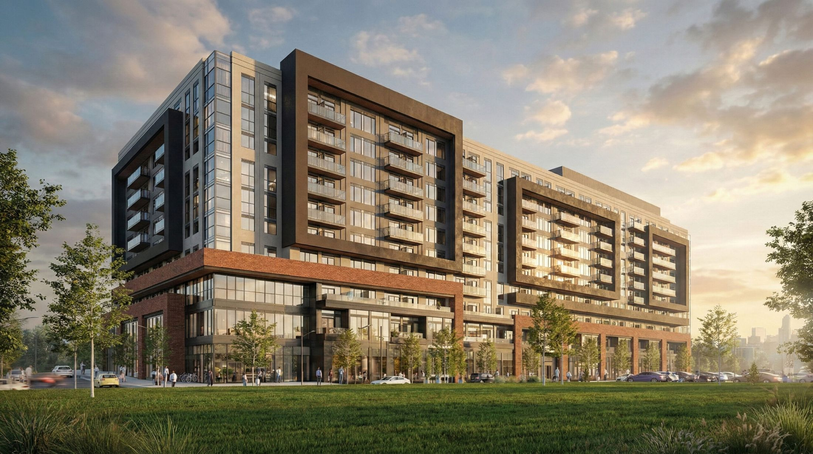
    </picture>
    

  

  

    
Coming Soon to Downtown Niagara Falls

    <h1 data-reveal style="--d:.28s">Parkline Apartments</h1>
    
A new purpose-built rental community taking shape at 4500 Park Street.

    

      <a class="btn" href="#project">
        Discover Parkline
        <svg width="11" height="12" viewBox="0 0 11 12" fill="none" aria-hidden="true"><path d="M5.5 0v10.5M1 6.5l4.5 4.5L10 6.5" stroke="currentColor" stroke-width="1.2"/></svg>
      </a>
      

        362 Residences
        10 Storeys
        Downtown Niagara Falls
      

    

  

  
Scroll

</section>

<!-- Partner strip -->
<section class="partners" aria-label="Project partners">
  

    
In Partnership With

    

      
      
      
    

  

</section>

<!-- 3 · Project introduction -->
<section class="section" id="project" aria-label="Project introduction">
  

    
The Project

    

      

        <h2 class="heading" data-reveal>A New Chapter for Downtown Niagara&nbsp;Falls</h2>
        

          
Elite Developments, in partnership with the City of Niagara Falls, is bringing Parkline Apartments to 4500 Park Street in the heart of downtown Niagara Falls.

          
The 10-storey, purpose-built rental community will introduce 362 new residences designed to support the evolving needs of the city. Twenty per cent of the building will be dedicated to affordable and attainable housing, reinforcing a shared commitment to creating accessible, high-quality and well-located rental options.

        

      

      

        <figure class="gfig">
          

            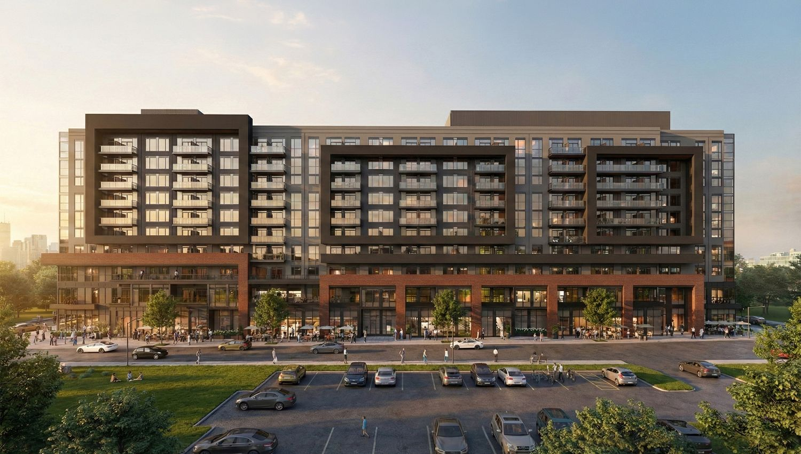
          

          <figcaption class="intro__caption">Artist's concept, 4500 Park Street entrance</figcaption>
        </figure>
      

    

  

</section>

<!-- 4 · Project facts -->
<section class="facts" aria-label="Project facts">
  

    

      

        
362

        
Purpose-Built Rental Residences

      

      

        
10

        
Storeys

      

      

        
20%

        
Affordable and Attainable Housing

      

      

        
4500

        
Park Street, Niagara Falls

      

    

  

</section>

<!-- 5 · Landmark partnership -->
<section class="section partnership" id="partnership" aria-label="Landmark partnership">
  

    
The Partnership

    

      

        <h2 class="heading" data-reveal>Built Through Partnership</h2>
      

      

        

        
Parkline Apartments represents a landmark collaboration between Elite Developments and the City of Niagara Falls. Through a forward-thinking partnership, the City contributed the land and became a 40 per cent shareholder in the project, helping accelerate new housing supply while creating long-term value for the community.

        
The development demonstrates what can be achieved when the public and private sectors work together toward a shared goal.

      

    

    

      
In Partnership With

      

        
      

      
      

        
      

    

  

</section>

<!-- 6 · Leadership quotes -->
<section class="section quotes" aria-label="Leadership perspectives">
  

    
In Their Words

    <figure class="quote" data-reveal>
      <blockquote>
        
&ldquo;Niagara Falls has set a standard. You&rsquo;re showing the province what can be achieved when the goal is shared and the process is driven by teamwork.&rdquo;

      </blockquote>
      <figcaption>
        Hamid Hakimi
        Chief Executive Officer, Elite Developments
      </figcaption>
    </figure>

    <figure class="quote" data-reveal>
      <blockquote>
        
&ldquo;By contributing the land and working collaboratively with Elite Developments, we&rsquo;re delivering a project that adds affordable housing and creates long-term financial value for our residents.&rdquo;

      </blockquote>
      <figcaption>
        Jason Burgess
        Chief Administrative Officer, City of Niagara Falls
      </figcaption>
    </figure>

    <figure class="quote" data-reveal>
      <blockquote>
        
&ldquo;These new residents will support local caf&eacute;s, restaurants, salons and shops, helping to create the lively, connected community we&rsquo;ve been working toward.&rdquo;

      </blockquote>
      <figcaption>
        Jim Diodati
        Mayor, City of Niagara Falls
      </figcaption>
    </figure>
  

</section>

<!-- 7 · Downtown impact -->
<section class="impact" aria-label="Downtown impact">
  

    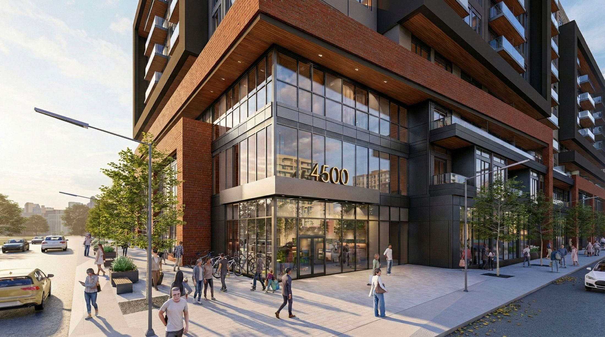
    

    

      

        
Downtown Niagara Falls

        <h2 class="heading" data-reveal style="--d:.12s">Connected to the Heart of the&nbsp;City</h2>
      

    

  

  

    

      

        
Located steps from regional transit and surrounded by local businesses, Parkline Apartments is positioned to bring new energy to downtown Niagara Falls.

        
More than 300 new rental residences will support housing demand while introducing new customers to neighbourhood caf&eacute;s, restaurants, salons, shops and services.

      

    

  

</section>

<!-- 8 · Groundbreaking -->
<section class="section ground" id="groundbreaking" aria-label="Groundbreaking ceremony">
  

    
A Milestone Moment

    

      <h2 class="heading" data-reveal>Parkline Apartments Breaks Ground</h2>
      

        
Elite Developments and the City of Niagara Falls officially marked the beginning of Parkline Apartments with a groundbreaking ceremony at 4500 Park Street.

        
The event brought together representatives from the City, Elite Developments, Brooklyn Construction and community partners to celebrate a shared commitment to new housing and the continued growth of downtown Niagara Falls.

      

    

    

      

        <figure class="gfig g-full">
          

            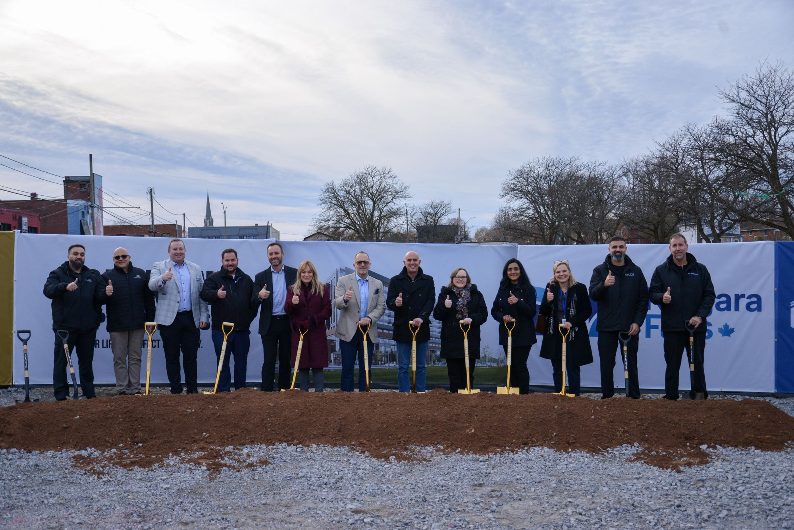
          

          <figcaption>Official groundbreaking at 4500 Park Street</figcaption>
        </figure>
      

      

        <figure class="gfig g-a1">
          

            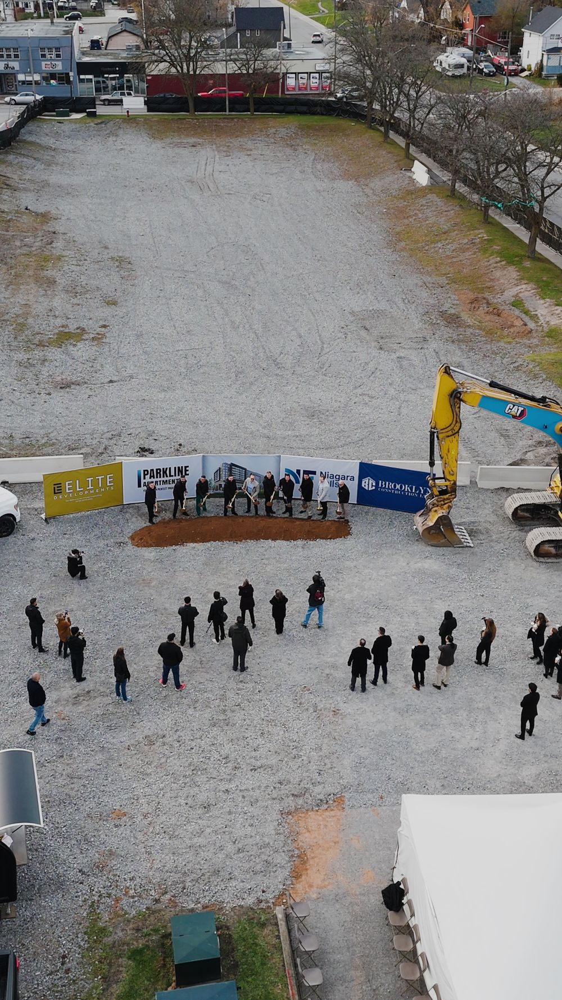
          

          <figcaption>The ceremony from above</figcaption>
        </figure>
        <figure class="gfig g-a2">
          

            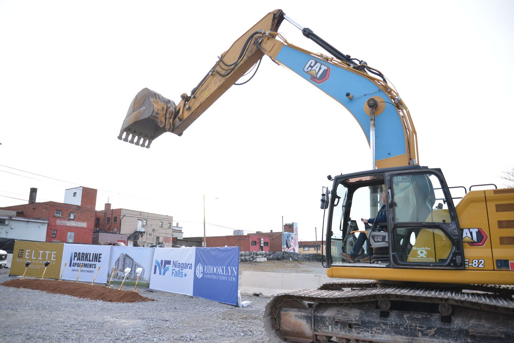
          

          <figcaption>Ready to break ground</figcaption>
        </figure>
      

      

        <figure class="gfig g-b1">
          

            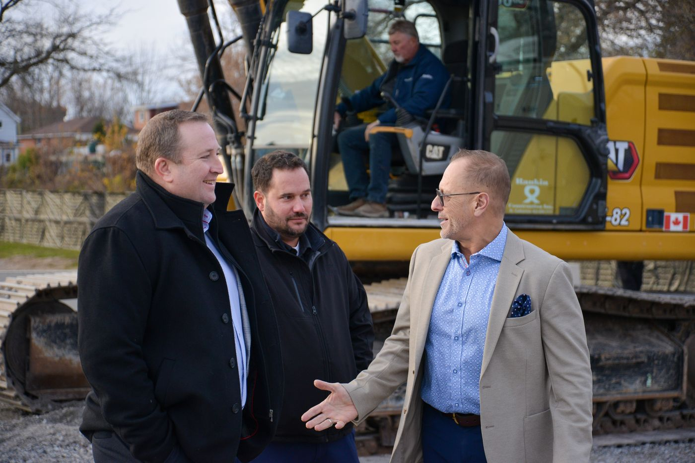
          

          <figcaption>Representatives from Elite Developments, the City of Niagara Falls and project partners</figcaption>
        </figure>
        <figure class="gfig g-b2">
          

            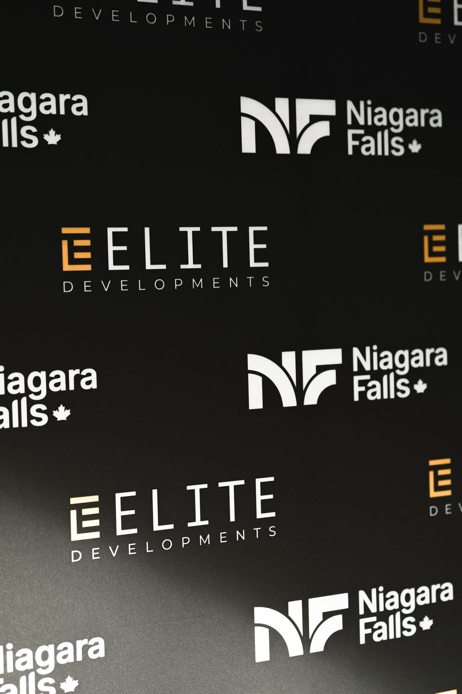
          

        </figure>
      

      

        <figure class="gfig g-c1">
          

            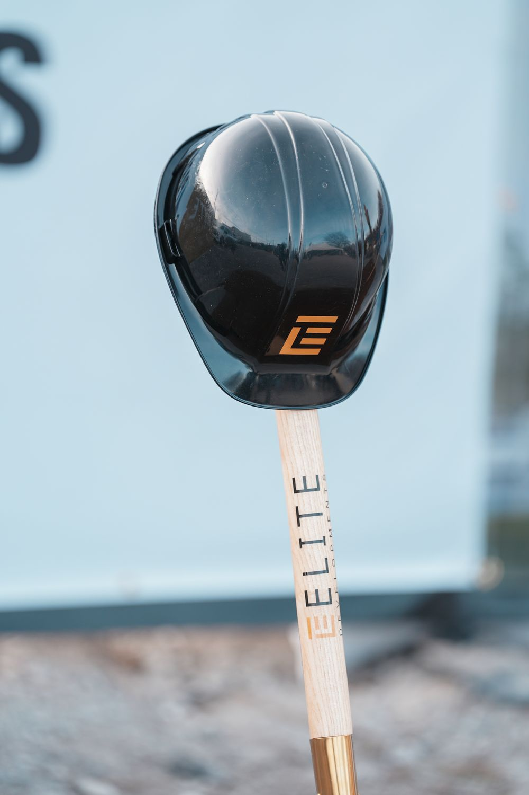
          

        </figure>
        <figure class="gfig g-c2">
          

            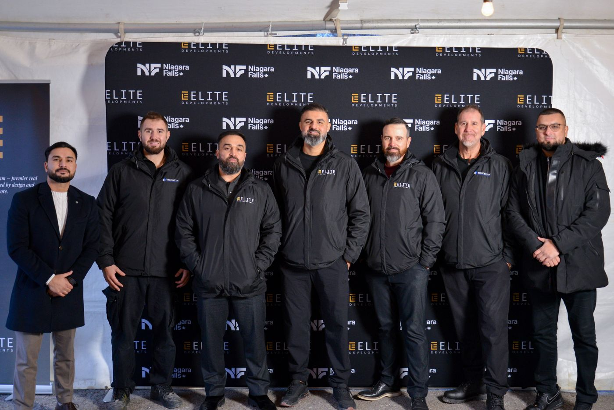
          

          <figcaption>Work begins on Park Street</figcaption>
        </figure>
      

      

        <figure class="gfig g-d">
          

            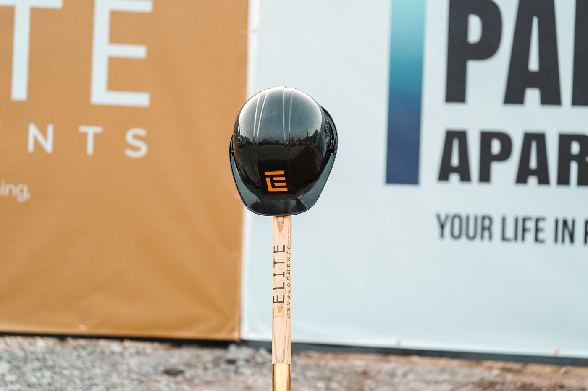
          

          <figcaption>A landmark partnership taking shape in downtown Niagara Falls</figcaption>
        </figure>
      

    

  

</section>

<!-- 9 · Contact -->
<section class="section contact" id="contact" aria-label="Contact">
  

    
Coming Soon

    <h2 class="heading" data-reveal style="--d:.12s">More Is Coming</h2>
    
Parkline Apartments is taking shape in the heart of downtown Niagara Falls. Additional project information will be released as the community progresses.

    

      <a href="tel:+18444844184" data-reveal style="--d:.34s">1.844.484.4184</a>
      <a href="mailto:sales@elitedevelopments.com" data-reveal style="--d:.44s">sales@elitedevelopments.com</a>
    

    

      <a class="btn btn--ink" href="mailto:sales@elitedevelopments.com">
        Contact Elite Developments
        <svg width="12" height="11" viewBox="0 0 12 11" fill="none" aria-hidden="true"><path d="M0.5 5.5h10M6.5 1l4.5 4.5L6.5 10" stroke="currentColor" stroke-width="1.2"/></svg>
      </a>
    

  

</section>

</main>

<!-- 10 · Footer -->
<footer class="footer">
  

    

      

        
      

      

        In Partnership With
        

          
          
        

      

      

        
4500 Park Street Niagara Falls, Ontario

        

          <a href="tel:+18444844184">1.844.484.4184</a> 
          <a href="mailto:sales@elitedevelopments.com">sales@elitedevelopments.com</a>
        

      

    

    

      
All renderings and illustrations are artist's concepts and are subject to change. Project details are provided for general information and may be updated without notice. E. &amp; O.E.

      
&copy; 2026 Parkline Apartments

    

  

</footer>

</body>
</html>
